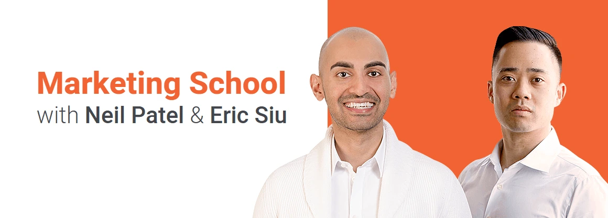

There are so many podcasts in this world. If you install an app or open the podcast app, you will burst with so many suggestions and the thing you don't want to listen to or don't care about. So you are now in deep trouble and what to hear. I'll make things easier for you. Following are podcasts that I lesson daily because it provides you tons of thing without regarding your industry you are in. Related to your industry, there are so many things you can listen to. Yes, you can learn and gain knowledge but if you are too lazy to do it and you are not enthusiastic.L listen to these hosts and their guests, you can fill your mind with positive attitudes that can lead to many successes.

## Need to leverage your full potential

This podcast helps me to find all these others and provides great knowledge about your life and how you can achieve things. The host is [Andrew Ferebee](https://www.knowledgeformen.com/about/) who is a life coach with a great success story.

> Knowledge For Men [Link](https://www.knowledgeformen.com/podcasts/)

## Tips from the best

You want to be an entrepreneur with great heights and guidelines then this the best podcast you can find for that. The host [John Lee Dumas](https://www.eofire.com/about/) is a former Armor Platoon Leader (Tanks). Now making his living from podcasts. Read his bio, it has so many things you can learn.

> EOFire [Link](https://www.eofire.com/podcast/)

## The real men magazine

Are you still reading this shitty men maganize, tells you 'How to get a girl in ten seconds', 'How to get your dream body in ten days'. BULLSHITS. Stop reading those, it will make you dumb. You need to read and listen to real men's stuff. This podcast provides that vision to the world. [Brett McKay](https://www.artofmanliness.com/about-2/) is the founder and editor-in-chief of AOM who want to change the way of men's magazine for good.

> Art of Manliness [Link](https://www.artofmanliness.com/podcast/)

## Marking trends and tips in your ear

Marketing is a new thing for everyone in this world, you need to start from someway. You learn so many thing via marketing that you don't see in a product. [Eric Siu](https://www.linkedin.com/in/ericosiu/)
and [Neil Patel](https://www.linkedin.com/in/neilkpatel/) are helping you to find those thing you need to know about marketing daily. They provide a tons of thing you can easily apply for your thing.

> Marketing School Podcast [Link](https://marketingschool.io/)

## Is that all

There are so many thing you can listen via the thing you want to search. This are my recommendations for you guys, feel free to find new thing and learn thing. My opinion is, podcast has become a great source of knowledge and a great way to find new thing with out looking at screen. You can do it while you driving, eating, etc.. Life is a learning guys.
