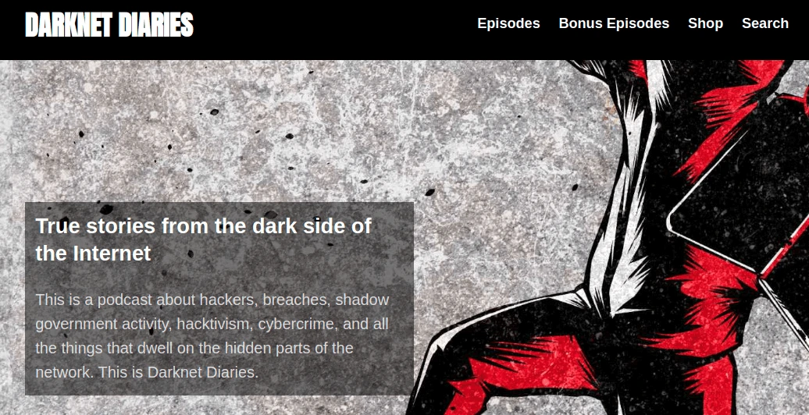

There are times, you will be addicted to something. For some, it can be an activity, band, person and so many different things. In some cases, your addiction may be crafted by someone else. Like I illustrated in [persuasive design ideas used in social media applications](/posts/persuasive-designs/). I am not going to dive deep into social media stuff, just read it. I am talking about my addictions and what it has done to me. My zen is simple. I listen to podcasts whenever I go spare time. I had some addictions over the past but the force is strong with this.

There were few reasons,

- You don't engage with the screen to check on it, you can play it in the background
- Management won't ask you question about it, you can recommend it which will give you thumbs up
- The biggest plus point is, you can be in work mode while you are concentrating on someone else voice.

## Where it got started

Initially, I started to listen to [a few podcasts to enhance my personality](/posts/a-year-with-podcast-life/). After some time, I started to listen to few different podcasts related to my career. I stumble with some dark stuff related to crime and cyber stuff. [Darknet Diaries](https://darknetdiaries.com/) is one of the interesting candidates for crime-related podcasts. It delivers some crazy stories, you will sometimes never heard. Those stories are amazing and sometimes you will end up with 'Really.., is that easy'

<figure>

</figure>

It's all about hackers and their hacking history. When you listen to some of those stories, you will feel like you can be a hacker too. Some stories will tell you that they have only used the Chrom Dev tool to get some information. Even though, Wikipedia says something like this,

> A computer hacker is a computer expert who uses their technical knowledge to achieve a goal or overcome an obstacle, within a computerized system by non-standard means.

You don't need to an expert in a computer-related field to be like that. There are various definitions for the hacker but it depends.

## What is all about

It is all about hacks done by various people and groups. Some are brutal one which ends up with sabotage a corporation, government or whole country. Some are very dark ones like dealing drugs on the internet, facilitation for those and so much stuff. Also, it is featured with white-collar hackers who did some good deeds to this world. There are so many things you can check on it.
Darknet Diaries is hosted by person name ['Jack Rhysider'](https://twitter.com/jackrhysider). I don't have any idea who is he but he is an awesome guy to listen to.

## What you know

I didn't listen to all episodes but I listen to some interesting ones to catch up because there were a lot of episodes to be covered. Especially the reference ones in an interesting episode. Kind of like, I missed some of the important parts of the whole picture. I am happy with what I got. After I listen to some of those episodes, I feel like I should try some of those. Why I know those they were talking about because I used some of those tools every day. In some instances, I went to particular websites and tools they were talking about but hold my nerves to continue it.

Lately, I end up with an episode call ['NOTPETYA'](https://darknetdiaries.com/episode/54/) which was featured in a recent episode and took me to the extreme level. Yes, pretty much extreme. It was talking about sabotaging a country and its all activities. It is one of the chilling episodes to attend. The whole episode talks about the chain reaction of the hack. How it got started, spread and aftermath. In the middle of the episode, you will think about your country also.

Anyhow long story shorty it's a cyber horror story. It was talking but some open-source application and some secret software application which was snatched. All those tools are freely available if you put in your effort.

## What happens

Recently, I went to a bank in our country (I am not going to mention any details of the establishment). In there, the bank had whole the parameters aligned with the above mention story. I was actually plotting plan mind head how to attack the bank system. Checking WIFI signal and guessing the password to log in to see who are the others connected to the same network. Checking at their screen what are the applications they are using, how they interact with them. I was combing tools and techniques in my mind on how to execute my evil plan. I had every component and method to execute my plan to break into the bank. I even had a person inside the branch to get any information.

Is it necessary to this? I have two options to select,

- Execute my plan and tell the bank its vulnerabilities
- Or do the evil thing

All those things can be done if I got succeed. There is the bad side of it too. Keeping me out doing it. The biggest fear of every hacker. I don't have any authorization to execute as alike penetration tester. My perspective has been changed but I am keeping my nerve to experiment.

## Resources

- [Darknet Diaries website](https://darknetdiaries.com/)
- [Mimi Katz](https://github.com/gentilkiwi/mimikatz/wiki)
- [Hacker One](https://www.hackerone.com/for-hackers/start-hacking)
- [Impact of NotPetya Ransomware](https://infotransec.com/news/the-impacts-of-notpetya-ransomware-what-you-need-to-know/)
